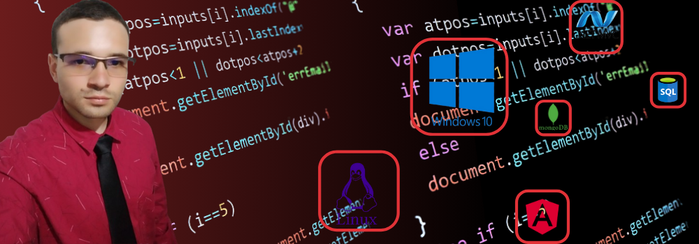
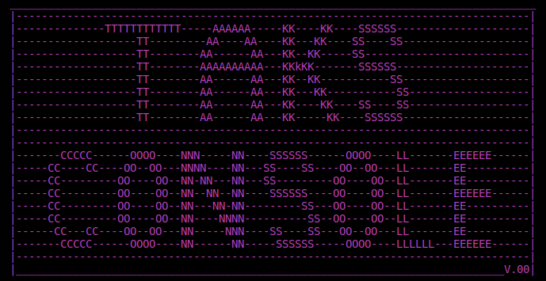

# ¡Hola, soy DevJhojan! :wave:

  
  

    <a href="https://devjhojan.github.io/MyProfile/"><strong>Visita mi portafolio</strong></a> · 
    <a href="mailto:devjhojan@gmail.com">devjhojan@gmail.com</a>
  

**Desarrollador de software con más de 8 meses de experiencia construyendo aplicaciones web escalables.** Me enfoco en crear soluciones limpias, modulares y fáciles de mantener, siempre con actitud colaborativa y orientación a resultados. Me impulsa aprender rápido, incorporar nuevas tecnologías y aportar valor en cada iteración. :fire:

> También puedes hacer clic en la imagen para ver mi portafolio.

---

## Conecta conmigo

---

## Stack principal

**Lenguajes & Frameworks**

## Proyectos destacados

  <table>
    <tr>
      <td align="center" width="300">
         
        <strong>PokeDesk</strong> 
        Buscador de Pokémon con consumo de API, listado paginado y vistas responsivas.
      </td>
      <td align="center" width="300">
         
        <strong>Rick & Morty Finder</strong> 
        Explorador con animaciones y consumo de API para fans de la serie.
      </td>
    </tr>
    <tr>
      <td align="center" colspan="2">
         
        <strong>TaskConsole</strong> 
        Consola de comandos para gestionar pendientes desde una interfaz estilo terminal.
      </td>
    </tr>
  </table>

---

## Logros y aprendizaje continuo

- **Experiencia colaborativa:** liderazgo de features, revisión de código y mentoría a compañeros.
- **Arquitectura escalable:** patrones modulares, separación de responsabilidades y pruebas manuales exhaustivas.
- **Estilo de trabajo:** enfoque ágil, comunicación transparente y documentación clara para transferencias fluidas.

---

## Estudiando actualmente

---

  

---

## Estatus de este repositorio

---